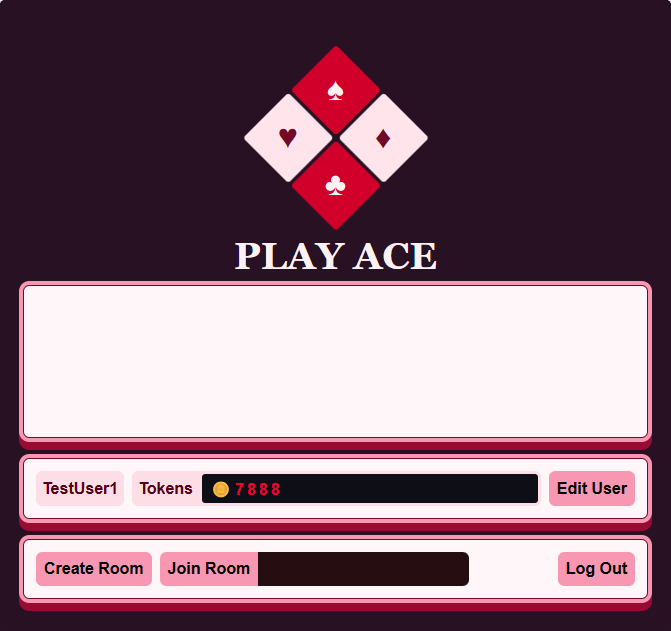
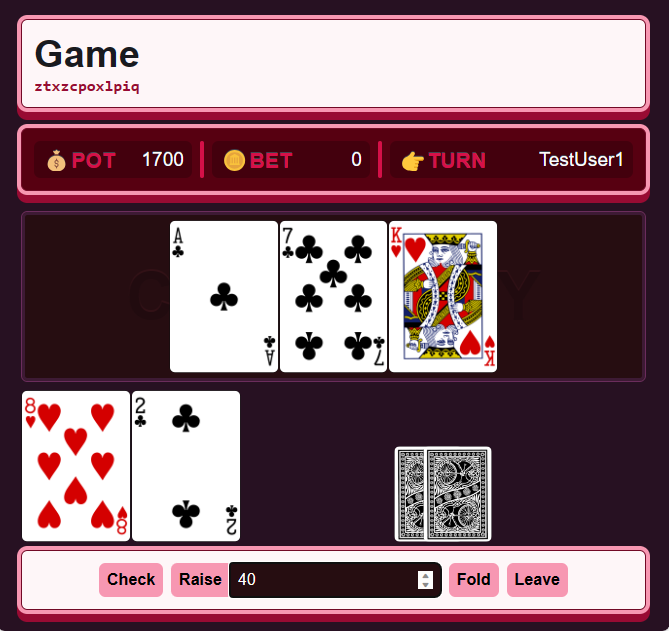
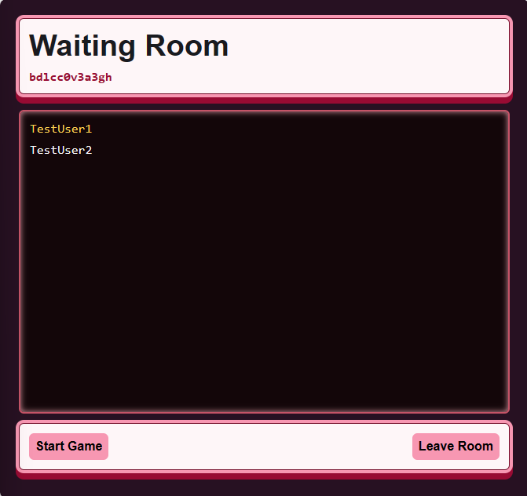

 

# Play Ace - Free Online Poker

A full-stack React app where you can play poker with multiple people. 
Users can securely sign up and login to the application and begin playing. 
Every user gets 100,000 tokens to use for the game and no real money is used for the game.

A paragraph used to introduce interested parties to the project and needs to include one or more screenshots.

## Getting Started
[Trello Board](https://trello.com/b/gZqUsYnR/perscholas-capstone)

[Client Flow Diagram](./public/diagram_client_flow.png)

[Server Flow Diagram](./public/diagram_server_flow.png)

## Technologies Used 

<b>Front End</b>
  - HTML
  - CSS
  - Javascript
  - Node.js
  - React
  
<b>Back End</b>
  - Express.js
  - Mongoose
  - MongoDB 
  - JWT
  - Bcrypt

<b>Additional Systems and Methodologies</b>
  - [Deck of Cards API](https://deckofcardsapi.com/)
  - Long polling 

## Additional Resources

### Poker Hand Ranking
This program relies on [@subskybox](https://www.codeproject.com/Members/subskybox)'s poker ranking algorithm.
which uses bitwise operations to determine the rank of a poker hand.

#### [@subskybox's Article](https://www.codeproject.com/Articles/569271/A-Poker-hand-analyzer-in-JavaScript-using-bit-math)

### Long polling
Implements long polling methodology as an alternative to web sockets. 
This was done because the project was only a week long and I did not want to spend more 
time than necessary learning how to implement a web sockets package that I have not researched yet.

#### [Ably Article on Long Polling](https://ably.com/topic/websocket-alternatives#long-polling)
#### [Stack Overflow Post on implementing Long Polling](https://stackoverflow.com/a/45854088)

## Unsolved Problems
- Server functions had to be slowed down due to API calls responding before they finished, so player actions are not that responsive
- Server will likely crash if multiple actions are submitted in similar time frames
- Server can hang sometimes and needs to be manually reset
- Leaving rooms sometimes does not work and I can't figure out why
- Users can play while having negative currency
- Some values on the screen do not update
- Missing some user centric design elements
- Missing room list on home page

## Future Enhancements
- Replace long polling system with web sockets for better user experience
- Attempt to find a way to speed server interactions
- Put a limit on the amount of people that can join a game
- Better user interface
- Delete empty rooms
